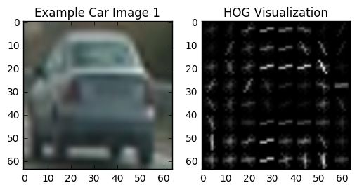
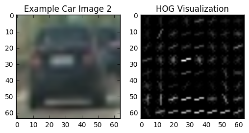
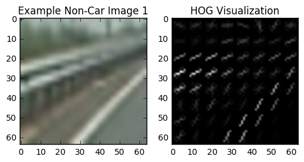
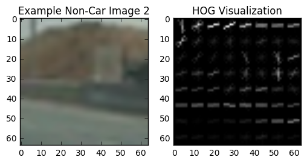
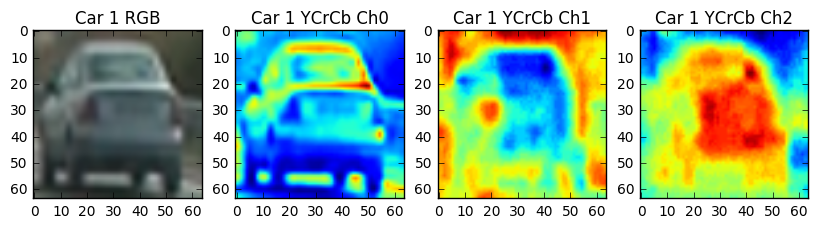
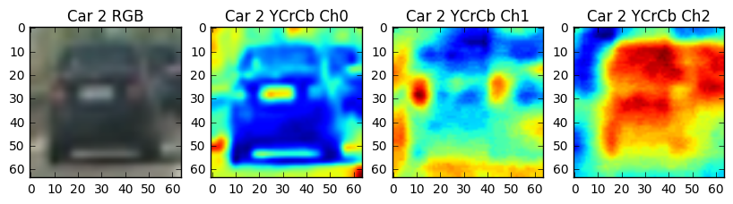
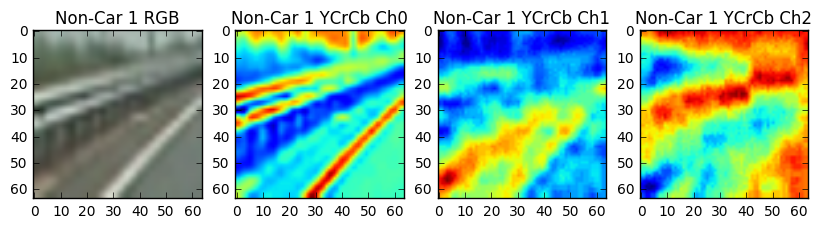
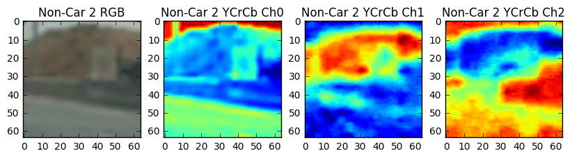

# Vehicle Detection

### This is the Project 5 of Udacity Self-driving Car Nanodegree Term 1. 
### In this project, the goal is to write a software pipeline to detect vehicles in a video (start with the test_video.mp4 and later implement on full project_video.mp4).
---

The goals / steps of this project are the following:

* Perform a Histogram of Oriented Gradients (HOG) feature extraction on a labeled training set of images and train a classifier Linear SVM classifier
* Optionally, you can also apply a color transform and append binned color features, as well as histograms of color, to your HOG feature vector. 
* Note: for those first two steps don't forget to normalize your features and randomize a selection for training and testing.
* Implement a sliding-window technique and use your trained classifier to search for vehicles in images.
* Run your pipeline on a video stream (start with the test_video.mp4 and later implement on full project_video.mp4) and create a heat map of recurring detections frame by frame to reject outliers and follow detected vehicles.
* Estimate a bounding box for vehicles detected.

Here are links to the labeled data for [vehicle](https://s3.amazonaws.com/udacity-sdc/Vehicle_Tracking/vehicles.zip) and [non-vehicle](https://s3.amazonaws.com/udacity-sdc/Vehicle_Tracking/non-vehicles.zip) examples to train the classifier.  These example images come from a combination of the [GTI vehicle image database](http://www.gti.ssr.upm.es/data/Vehicle_database.html), the [KITTI vision benchmark suite](http://www.cvlibs.net/datasets/kitti/), and examples extracted from the project video itself.   You are welcome and encouraged to take advantage of the recently released [Udacity labeled dataset](https://github.com/udacity/self-driving-car/tree/master/annotations) to augment your training data.  

## Two Jupyter Notebooks for this Project
### 1. The first one is "P5_train_svc.ipynb"
The SVM classifier is trained in this notebook. The exploration of the features are also included in this notebook.  
### 2. The second one is "P5_vehicle_detection.ipynb"
The vehicle detection pipeline for the video processing is developed in this notebook.  

## Histogram of Oriented Gradients (HOG)

### 1. Explain how (and identify where in your code) you extracted HOG features from the training images.
The code for this step is contained in the "P5_train_svc.ipynb" code cell 2. 

I randomly select two car images and two non-car images to compare there HOG figures. 
The two example images are shown as follows, the parameters of the HOG feature I am using is 
`orient = 9
pix_per_cell = 8
cell_per_block = 2`

  
  

We can find that the HOG features of the cars and non-cars are really very different from each other. We can still tell the outline of the car from the HOG image. 

### 2. Explore the Color Space
I experimented getting the features in different color channels such as RGB , HSV , YUV , YCrCb , HLS with different parameters. However I got the best results using the YCrCb transformation. The examples are shown below, in which we can easily easily tell the body of the car and non-car road line. 

  
  

### 2. Explain how you settled on your final choice of parameters.
In the final choice of the features, I choose three features.  
1. HOG Features.  I am using all the 3 channels for extracting the HOG features.

2. Binned Color Features.  `spatial_size = (32, 32)`

3. Color Histogram Features.  `color_space = 'YCrCb'`

The feature extraction function is in the "P5_train_svc.ipynb" code cell 8. 

I tried various combinations of color spaces and parameters before finally settling with following:

`color_space = 'YCrCb'  
spatial_size = (32, 32)  
hist_bins = 32  
orient = 9  
pix_per_cell = 8  
cell_per_block = 2  
hog_channel = 'ALL'  
spatial_feat = True  
hist_feat = True  
hog_feat = True`  

### 3. Describe how (and identify where in your code) you trained a classifier using your selected HOG features (and color features if you used them).

## Sliding Window Search

### 1. Describe how (and identify where in your code) you implemented a sliding window search. How did you decide what scales to search and how much to overlap windows?

### 2. Show some examples of test images to demonstrate how your pipeline is working. What did you do to try to minimize false positives and reliably detect cars?

Ultimately I searched on two scales using YCrCb 3-channel HOG features plus spatially binned color and histograms of color in the feature vector, which provided a nice result. Here are some example images:

figures

## Video Implementation
### 1. Provide a link to your final video output. Your pipeline should perform reasonably well on the entire project video (somewhat wobbly or unstable bounding boxes are ok as long as you are identifying the vehicles most of the time with minimal false positives.)

### 2. Describe how (and identify where in your code) you implemented some kind of filter for false positives and some method for combining overlapping bounding boxes.

I recorded the positions of positive detections in each frame of the video. From the positive detections I created a heatmap and then thresholded that map to identify vehicle positions. I then used blob detection in Sci-kit Image (Determinant of a Hessian skimage.feature.blob_doh() worked best for me) to identify individual blobs in the heatmap and then determined the extent of each blob using skimage.morphology.watershed(). I then assumed each blob corresponded to a vehicle. I constructed bounding boxes to cover the area of each blob detected.

Here's an example result showing the heatmap and bounding boxes overlaid on a frame of video:

figures

## Discussion
### 1. Briefly discuss any problems / issues you faced in your implementation of this project. Where will your pipeline likely fail? What could you do to make it more robust?

Here I'll talk about the approach I took, what techniques I used, what worked and why, where the pipeline might fail and how I might improve it if I were going to pursue this project further.
