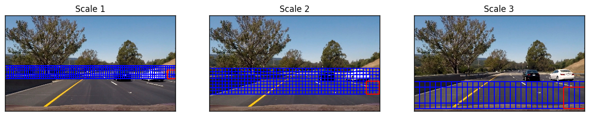

# Vehicle Detection
[](http://www.udacity.com/drive)

### This is the Project 5 of Udacity Self-driving Car Nanodegree Term 1. 
### In this project, the goal is to write a software pipeline to detect vehicles in a video (start with the test_video.mp4 and later implement on full project_video.mp4).
---

The goals / steps of this project are the following:

* Perform a Histogram of Oriented Gradients (HOG) feature extraction on a labeled training set of images and train a classifier Linear SVM classifier
* Optionally, you can also apply a color transform and append binned color features, as well as histograms of color, to your HOG feature vector. 
* Note: for those first two steps don't forget to normalize your features and randomize a selection for training and testing.
* Implement a sliding-window technique and use your trained classifier to search for vehicles in images.
* Run your pipeline on a video stream (start with the test_video.mp4 and later implement on full project_video.mp4) and create a heat map of recurring detections frame by frame to reject outliers and follow detected vehicles.
* Estimate a bounding box for vehicles detected.

Here are links to the labeled data for [vehicle](https://s3.amazonaws.com/udacity-sdc/Vehicle_Tracking/vehicles.zip) and [non-vehicle](https://s3.amazonaws.com/udacity-sdc/Vehicle_Tracking/non-vehicles.zip) examples to train the classifier.  These example images come from a combination of the [GTI vehicle image database](http://www.gti.ssr.upm.es/data/Vehicle_database.html), the [KITTI vision benchmark suite](http://www.cvlibs.net/datasets/kitti/), and examples extracted from the project video itself.   You are welcome and encouraged to take advantage of the recently released [Udacity labeled dataset](https://github.com/udacity/self-driving-car/tree/master/annotations) to augment your training data.  

## Two Jupyter Notebooks for this Project
### 1. The first one is "P5_train_svc.ipynb"
The SVM classifier is trained in this notebook. The exploration of the features are also included in this notebook.  
### 2. The second one is "P5_vehicle_detection.ipynb"
The vehicle detection pipeline for the video processing is developed in this notebook.  


## Histogram of Oriented Gradients (HOG)

### 1. Explain how (and identify where in your code) you extracted HOG features from the training images.
The code for this step is contained in the "P5_train_svc.ipynb" code cell 2. 

I randomly select two car images and two non-car images to compare there HOG figures. 
The two example images are shown as follows, the parameters of the HOG feature I am using is 
`orient = 9
pix_per_cell = 8
cell_per_block = 2`


  
  


We can find that the HOG features of the cars and non-cars are really very different from each other. We can still tell the outline of the car from the HOG image. 

### 2. Explore the Color Space
I experimented getting the features in different color channels such as RGB , HSV , YUV , YCrCb , HLS with different parameters. However I got the best results using the YCrCb transformation. The examples are shown below, in which we can easily easily tell the body of the car and non-car road line. 


  
  


### 2. Explain how you settled on your final choice of parameters.
In the final choice of the features, I choose three features.  
1. HOG Features.  I am using all the 3 channels for extracting the HOG features.  
2. Binned Color Features.  `spatial_size = (32, 32)`  
3. Color Histogram Features.  `color_space = 'YCrCb'`

The feature extraction function is in the "P5_train_svc.ipynb" code cell 8. 
I tried various combinations of color spaces and parameters before finally settling with following:
 
```
color_space = 'YCrCb'  
spatial_size = (32, 32) 
hist_bins = 32  
orient = 9  
pix_per_cell = 8  
cell_per_block = 2  
hog_channel = 'ALL'  
spatial_feat = True  
hist_feat = True  
hog_feat = True`  
```
For each image, the feature vector has length 8460. 

### 3. Describe how (and identify where in your code) you trained a classifier using your selected HOG features (and color features if you used them).

The extracted features where fed to `LinearSVC` model of `sklearn` with default setting of `square-hinged` loss function and `l2` normalization. The trained model had accuracy of `99.1%` on test dataset. 

The trained model along with the parameters used for training were written to a `pickle` file to be further used by vehicle detection pipeline.

The codes can be found at the "P5_train_svc.ipynb".

## Sliding Window Search

### 1. Describe how (and identify where in your code) you implemented a sliding window search. How did you decide what scales to search and how much to overlap windows?

The bacis function 'find_cars()' to detect the car can be found in the file  "P5_vehicle_detection.ipynb". It is used to extract features using hog sub-sampling and make predictions. The hog sub-sampling helps to reduce calculation time for finding HOG features and thus provided higher throughput rate.  

In the basic one, 64 was the orginal sampling rate, with 8 cells and 8 pix per cell. The step size is `cells_per_step = 2`, which means instead of overlap, we shift 2 cells each step.

The following figure shows when I set the scale to be `scale = 1.5`, the detection example. 


Then I used the heat map operation to take care of the multi-detection and reduce the false positive. The example images are shown below, which is basicly good.  


I have tried to directly use the one search scale `scale = 1.5` with heat map with `threshold = 1` to build the pipeline for video. This pipeline can be found in the function `detect_vehicles()`. The output video is basicly good. However, the there are still some false positives shown up and sometimes. And the bounding boxes are not stable and the cars in some frame may not be detected. 

In order to solve these problems, I decideted to use the multiscale search windows. 

Scale 1:
```
ystart = 380
ystop = 480
scale = 1
```

Scale 2:
```
ystart = 400
ystop = 600
scale = 1.5
```

Scale 3:
```
ystart = 500
ystop = 700
scale = 2.5
```



It will be more accurately detect the cars when appling the multiscale search. I also add a pipeline with "smoothing" to average the detection boxes across frames of the video to reduce the false positive and make the output stable. Details are discussed in the next question. 


### 2. Show some examples of test images to demonstrate how your pipeline is working. What did you do to try to minimize false positives and reliably detect cars?

Ultimately I searched on two scales using YCrCb 3-channel HOG features plus spatially binned color and histograms of color in the feature vector. 
I record the positions of positive detections in each frame of the video. From the positive detections I created a heatmap and then thresholded that map to identify vehicle positions. 

I also create the second video processing pipeline in the class 
`class VehicleDetector` which can be found in the file "P5_vehicle_detection.ipynb". 
The method `VehicleDetector.find_cars_smooth()` is used to detect the car. It is basicly the same as the function `find_cars()` defined before. However, it allows the multi-scale search. More importantly, the search is optimized by processing complete frames only once every 10 frames. The restricted search is performed by appending 50 pixel to the heatmap found in last three frames.
It really helps a lot to make the detection more robust and stable. 

Here are some example images produced by this new smoothing pipeline.  


## Video Implementation
### 1. Provide a link to your final video output. 

### Here is [the link to my final output video on Youtube.](https://youtu.be/BD6qX41Qap0)
In this final output, I combine the vehicle detection with the lane lines detection finished in Project 4. 

Here's an example result showing the bounding boxes on a frame of video:


## Discussion
### 1. Briefly discuss any problems / issues you faced in your implementation of this project. Where will your pipeline likely fail? What could you do to make it more robust?

I found that in some frame of the video, the 
